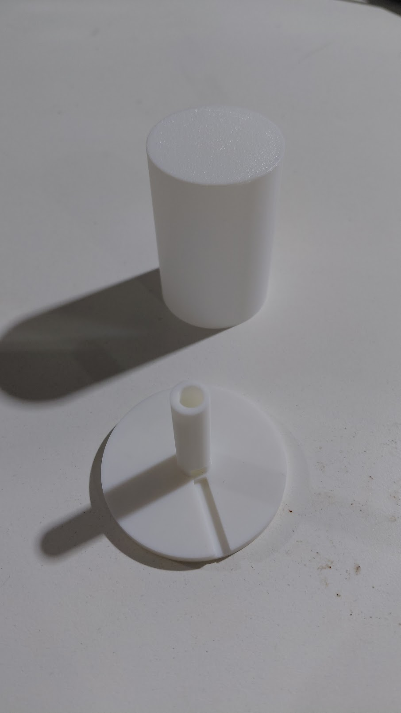
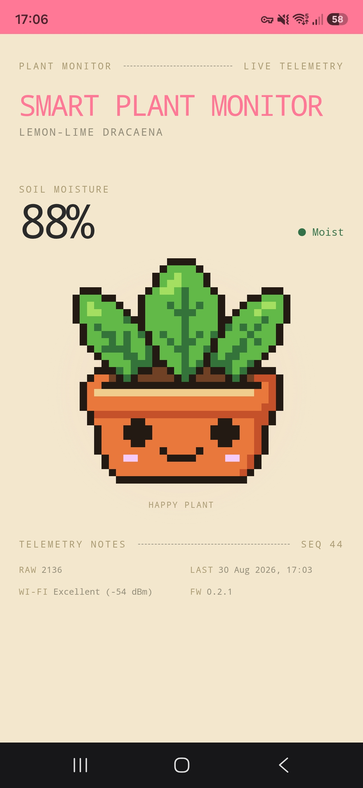
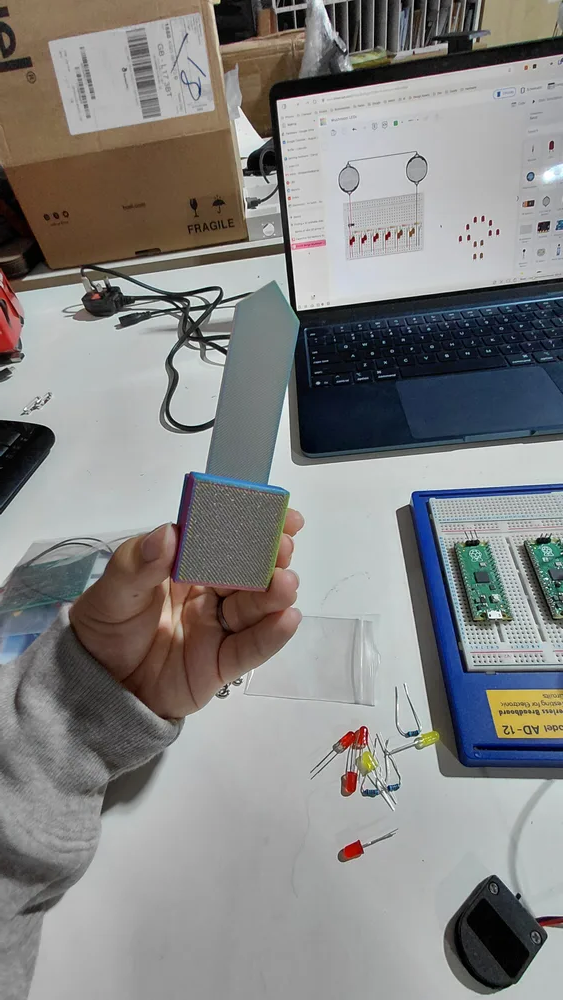

# Smart Plant Moisture Monitor

> An ESP32 smart plant monitor with a capacitive soil sensor, a 3D-printed RGB status lamp and an installable pixel-art PWA.

[][yt]
[][tt]
[][ig]
[][wokwi]

<a href="media/lamp-print.jpg"></a>

## What it does

A capacitive sensor reads the soil moisture around a lemon-lime dracaena. The ESP32 shows the current status on the RGB lamp and sends the reading to a Cloudflare-backed PWA.

The monitor has three live moisture states:

| Moisture state | Lamp | PWA character |
| --- | --- | --- |
| Moist | Green | Happy |
| Getting dry | Yellow | Worried |
| Dry | Red | Sad |

The sleeping character means the monitor is offline.

## Simulated circuit

| Simulator | Link | Notes |
| --- | --- | --- |
| Wokwi | [Open the simulation][wokwi] | ESP32, moisture input, and RGB output logic |

## Bill of materials

| Qty | Component | Part | Unit cost | Notes |
| --- | --- | --- | --- | --- |
| 1 | Starter kit | ESP32 Basic Starter Kit | £12.89 bundle | Shared purchase; included parts below are not charged again |
| 1 | Microcontroller | ESP32 development board | Included in kit | 3.3 V logic |
| 1 | Breadboard | 830 tie-points | Included in kit | Used for the prototype |
| 1 | USB cable | Data cable | Owned | |
| 1 | RGB LED | 5 mm, common cathode | Included in kit | One of two supplied in the kit |
| 3 | Resistor | 220 Ω from assorted pack | Included in kit | Three of 30 supplied in the kit |
| 7 | Jumper wires | Dupont F-M and M-M | Included in kit | Used on the breadboard prototype |
| 1 | Soil moisture sensor | Capacitive v1.2 | £0.48 | 3.3 to 5.5 V input, 0 to 3.0 V output, PH2.0-3P, 98 x 23 mm |
| 38.02 g | Printed parts | PLA Basic | £1.33 | 26.16 g colourful white + 11.86 g white, at £3.50 per 100 g |
| 1 | Mains USB plug | 5 V USB | Owned | |
| 1 | Plant | Lemon-lime dracaena | £4.99 | |

Project-specific materials: £6.80
Total including the full starter kit: £19.69.

## Wiring

| Component | Pin | ESP32 connection | Notes |
| --- | --- | --- | --- |
| Soil moisture sensor | VCC | 3V3 | Shared 3.3 V rail |
| Soil moisture sensor | GND | GND | Common ground |
| Soil moisture sensor | AOUT | GPIO 34 | ADC1 pin |
| RGB LED | Common cathode | GND | |
| RGB LED | Red anode | GPIO 25 through 220 Ω | PWM |
| RGB LED | Green anode | GPIO 26 through 220 Ω | PWM |
| RGB LED | Blue anode | GPIO 27 through 220 Ω | PWM |

## Firmware

The Arduino sketch is [`main/main.ino`](main/main.ino). It uses the ESP32 Arduino core.

1. Copy `main/secrets.example.h` to `main/secrets.h`.
2. Add the Wi-Fi details, API URL, and device key.
3. Open `main/main.ino` in Arduino IDE.
4. Select the matching ESP32 board and port, then upload the sketch.
5. Open Serial Monitor at 115200 baud.

## Web app

The installable React and Vite PWA receives readings through a Cloudflare Worker and stores them in D1.

[Open the live Smart Plant Monitor][live-pwa]

<a href="media/PWA.jpg"></a>

```sh
cd app
bun install
bun run dev
```

Use `bun run build` for a production build and `bun run lint` to check the code.

## Printed sensor case

The sensor case is based on [danielkrah's Capacitive Soil Moisture Sensor v1.2 Case][printables-vendor]. The four parts used here are in `print/stl/`:

| File | Part |
| --- | --- |
| `v4-outer-box.stl` | Protective sleeve |
| `v4-upper-case.stl` | Upper case half |
| `v4-bottom-case.stl` | Lower case half |
| `v4-sensor-dummy.stl` | Fit-test sensor dummy |

<a href="media/sensor-case-upright.webp"></a>

## RGB lamp head

The custom shade softens the LED and the base routes the four LED wires into the stake. The tested files target a **Bambu Lab P1S with a 0.4 mm nozzle** and use 0.2 mm layers.

| File | Contents |
| --- | --- |
| `print/3mf/lamp-shade-project.3mf` | Combined Bambu Studio project with shade and base |
| `print/3mf/lamp-shade-final.3mf` | Verified shade, 0% infill |
| `print/3mf/lamp-shade-base-v3-final.3mf` | Verified base, 15% infill |
| `print/3mf/print-profile.3mf` | P1S print settings |

The lamp files are also published as [RGB LED Lamp Shade on MakerWorld][makerworld-lamp].

## This project elsewhere

| Where | Link | What is there |
| --- | --- | --- |
| Live PWA | [Open the Smart Plant Monitor][live-pwa] | Latest reading and pixel-art moisture state |
| Portfolio | [Read the project page][portfolio] | Full build overview |
| MakerWorld | [RGB LED Lamp Shade][makerworld-lamp] | Lamp files and print details |
| Printables | [Original sensor case][printables-vendor] | Source enclosure design by danielkrah |
| YouTube Shorts | [Watch Part 1][part1-youtube] · [Watch Part 2][part2-youtube] | RGB lamp build and wireless PWA build |
| TikTok | [Watch Part 1][part1-tiktok] · [Watch Part 2][part2-tiktok] | RGB lamp build and wireless PWA build |
| Instagram | [Watch Part 1][part1-instagram] · [Watch Part 2][part2-instagram] | RGB lamp build and wireless PWA build |

## Licences

- Software and firmware: [MIT](LICENSE)
- Original lamp shade, base, build documentation and released project photographs: [CC BY-NC-SA 4.0](LICENSE)
- Sensor-case meshes by danielkrah: [CC BY-SA 4.0](LICENSE)

---

All projects at [github.com/TikitaTolley][gh].

[yt]: https://youtube.com/@tikitatech
[tt]: https://tiktok.com/@tikitatech
[ig]: https://instagram.com/tikitatech
[gh]: https://github.com/TikitaTolley
[portfolio]: https://tikitatech.xyz/projects/smart-plant-moisture-monitor/
[wokwi]: https://wokwi.com/projects/471268493966479361
[makerworld-lamp]: https://makerworld.com/en/models/3173248-rgb-led-lamp-shade
[printables-vendor]: https://www.printables.com/model/277601-capacitive-soil-moisture-sensor-v12-case-waterproo
[part1-youtube]: https://youtube.com/shorts/DsD2whw1M_8
[part1-tiktok]: https://www.tiktok.com/@tikitatech/video/7675019173306633494
[part1-instagram]: https://www.instagram.com/reel/DcJU_JGqnMz/
[part2-youtube]: https://youtube.com/shorts/lq9Cll0Gkk8
[part2-tiktok]: https://www.tiktok.com/@tikitatech/video/7680212442886032673
[part2-instagram]: https://www.instagram.com/reel/DctX8B5qHho/
[live-pwa]: https://smart-plant-monitor.daeda-technologies.workers.dev
